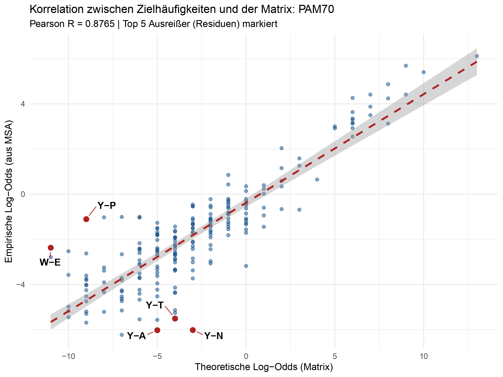
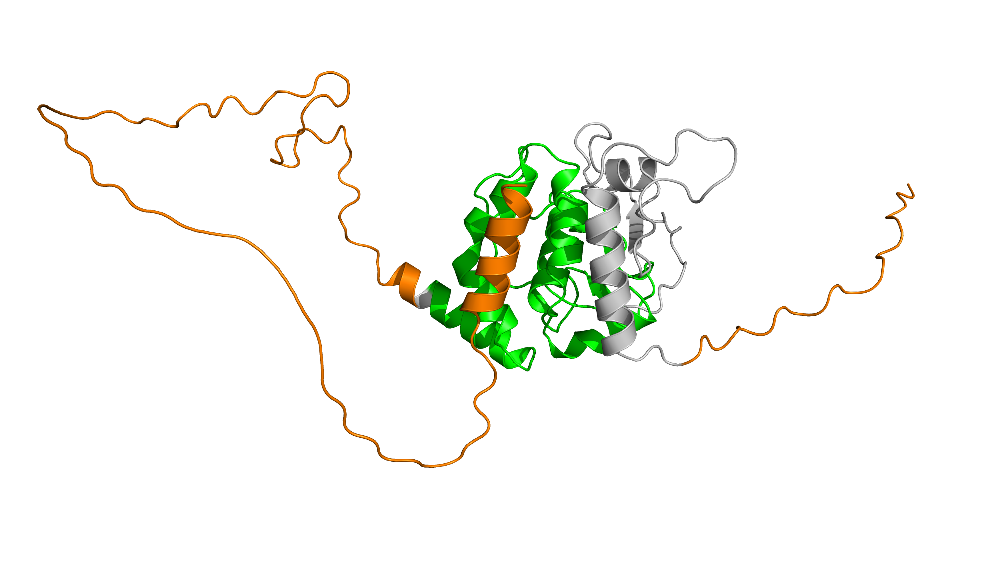
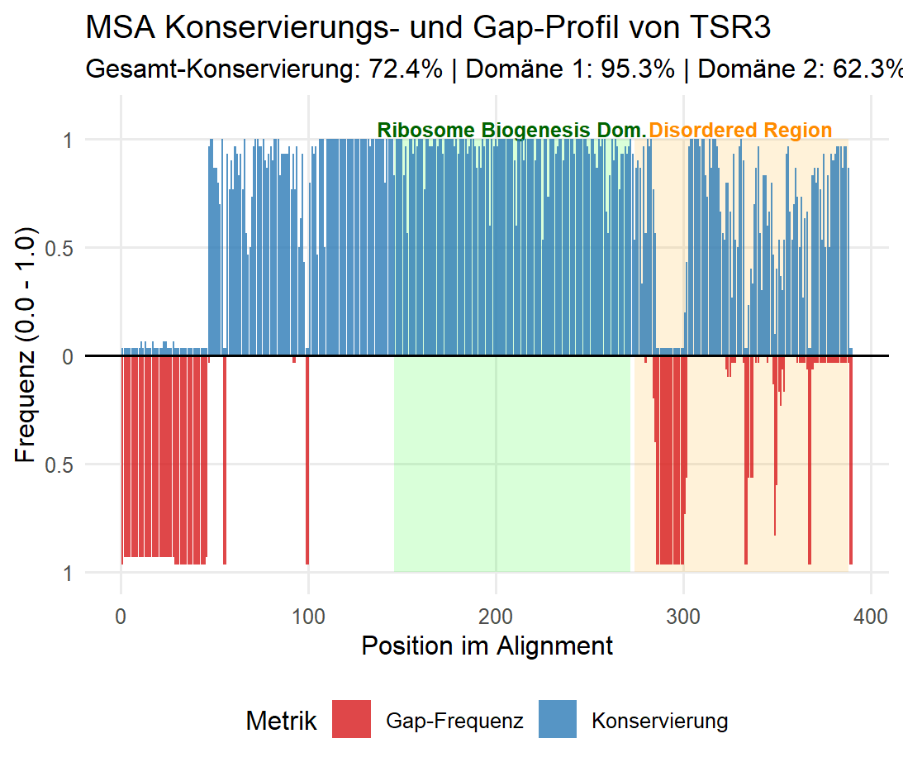
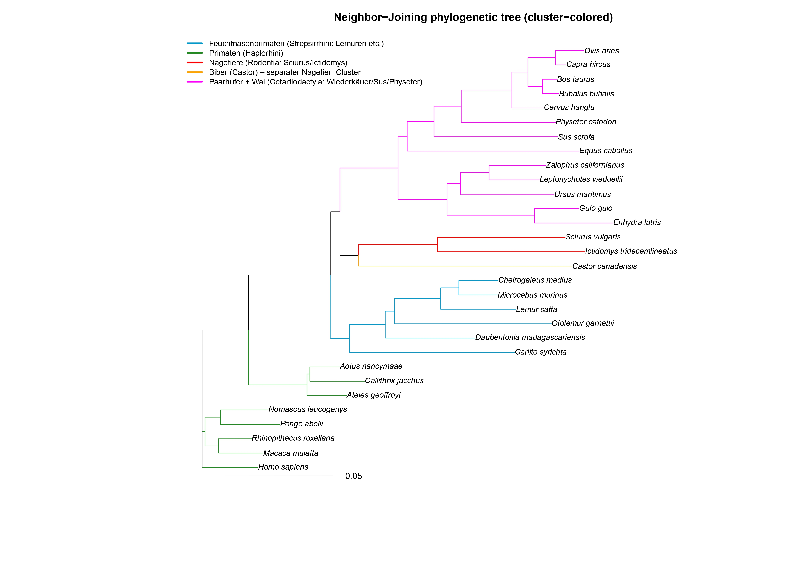

# Evolution of the TSR3 Ribosome Biogenesis Factor: A Critical Bioinformatics Evaluation

> **"Questioning the Algorithm: Why default parameters are not enough for deep evolutionary insights."**

This repository contains the full analytical pipeline for investigating the **TSR3 protein**, an essential factor in 18S rRNA hypermodification. This study moves beyond standard "black-box" bioinformatics by mathematically validating the choice of substitution matrices and correlating sequence conservation with structural stability.

---

## Scientific Highlights

### 1. Multi-Dimensional Matrix Evaluation
A central pillar of this project is the rejection of default parameters (like BLOSUM62) in favor of a mathematically justified selection. We evaluated the substitution matrices across two critical dimensions:

*   **Dimension A: Divergence Scaling (Relative Entropy):** 
    We analyzed the **Relative Entropy ($H$)** to determine the information density of the alignment. For the highly conserved TSR3 (>85% identity), **BLOSUM62** showed massive **underfitting** ($H_{theo} \approx 0.7$ bits vs. $H_{obs} \approx 1.6$ bits). Conversely, **PAM30** resulted in **overfitting** by over-penalizing natural variation. **PAM70** and **BLOSUM90** were identified as the optimal scaling points.

*   **Dimension B: Evolutionary Model (Correlation):** 
    We compared the **Markov-based PAM model** (continuous point mutations) against the **Block-based BLOSUM model**. Using Pearson correlation ($R$) between theoretical log-odds and empirical target frequencies from our MSA, **PAM70** emerged as the superior model ($R = 0.877$). This suggests that TSR3 evolution is better modeled as a continuous process of selective pressure on individual residues rather than conserved blocks.

> **Key Discovery:** Our validation revealed a "Tyrosine Anomaly"—substitutions involving **Tyrosine (Y)** were significantly rarer than predicted by any model, indicating a specialized structural requirement for this residue in TSR3.

---

### 2. Sequence-Structure Correlation (AlphaFold)
By integrating **AlphaFold 3** structural predictions with our Multiple Sequence Alignment (MSA), we identified a sharp dichotomy in the protein's architecture:

*   **The Catalytic Biogenesis Domain (Pos. 96–222):** 
    Characterized by **95.33% conservation** and a **0% gap rate**. AlphaFold confirms this as a highly stable core (**pLDDT > 90**), essential for SAM-binding and rRNA interaction.
*   **Intrinsically Disordered Regions (IDRs):** 
    The N- and C-termini exhibit significantly lower conservation (**62.35%**) and high gap tolerance (**22.29%**). AlphaFold predicts these as unstructured (**pLDDT < 50**), suggesting they function as dynamic recruitment hubs that do not require a rigid 3D fold.

*Figure 1: Mapping of the Biogenesis Domain (Green) and Disordered Regions (Orange) on the AlphaFold structure.*

*Figure 2: Statistical correlation between residue conservation and structural domains.*

---

### 3. Robust Phylogenetic Reconstruction
The phylogenetic tree was reconstructed using the **Neighbor-Joining (NJ)** method. 

*   **Selection Rationale:** Extensive testing for **Ultrametricity** and the **Four-Point Condition** revealed that the TSR3 dataset does not follow a strict "Molecular Clock." NJ was selected over UPGMA as it accounts for heterogeneous mutation rates across different lineages.
*   **Performance:** The NJ-tree achieved the highest **cophenetic correlation ($r_c = 0.977$)**, accurately reflecting the biological relationships within Primates, Cetartiodactyla, and Carnivora.

---

## Methodology & Tools
*   **Basic Local Alignment:** BLAST+ (optimized with PAM70).
*   **Sequence Alignment:** ClustalW (via the `msa` R-package).
*   **Phylogenetics:** `ape` and `seqinr` packages for distance-based clustering.
*   **Structure:** AlphaFold 3 Monomer Prediction.
*   **Environment:** WSL2 (Linux) with a Windows-side Anaconda environment.

---

## Conclusions
This project demonstrates that bioinformatics is not just about running tools, but about **understanding the mathematical foundations**. By justifying our evolutionary models and cross-validating with 3D structural data, we've provided a high-fidelity map of TSR3’s evolution.

**For a detailed 15-page analysis, including methodology and full discussion, see the [Full Project Report](J.Rasp,J.Vogel,R.Ortner;Bericht_Genomik_und_Phylogenie.pdf).**

---
*Created by Julian Rasp, Raphael Ortner, and Johann Vogel – April 2026*
